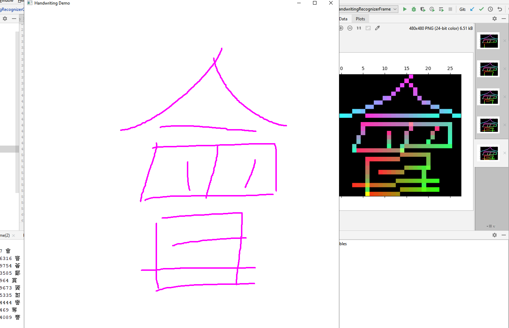
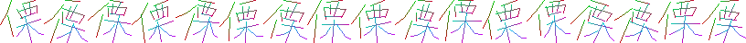

# cnn_chinese_hw

# Introduction

A convolutional neural network using Keras for recognising Chinese 
(Simplified/Traditional) and Japanese Kanji licensed under the LGPL 2.1. 
An advantage over many other open-source engines is that strokes can 
be drawn out-of-order (to an extent). 

It is intended to be used as an input method, and accepts x,y coordinate 
points of strokes as input parameters. This differs from some other
engines which are trained to recognise Kanji/Hanzi drawn on physical 
paper with a brush or pen.



# Install

Type:

```console
apt install git
pip3 install svg.path numpy
pip3 install git+https://github.com/mcyph/cnn_chinese_hw
```

If you just want to get predictions, you don't need a full `tensorflow` install -
you can use the instructions at https://www.tensorflow.org/lite/guide/python
to install just the tensorflow lite runtime. This also has the advantage that
the model can work on older processors which don't support the AVX extensions.

In order to train the model however, you will need `tensorflow` at least version 2.0+.
pip3 may need to be updated to do this.

```console
pip3 install --upgrade pip
pip3 install tensorflow
```

There are also some demo wxPython recognizer/new stroke registry applications in
the directory ``cnn_chinese_hw/gui``. These need wxPython, matplotlib and pillow 
in addition.`

# Recognize characters

```python
from cnn_chinese_hw.recognizer.TFLiteRecognizer import TFLiteRecognizer

rec = TFLiteRecognizer()
print(rec.get_L_candidates(
    [[(208, 0), (199, 119), (94, 341)],
     [(0, 461), (781, 520), (915, 520), (999, 479)],
     [(189, 167), (213, 209), (238, 826), (268, 934), (203, 910)],
     [(303, 514), (94, 766)],
     [(462, 17), (497, 586), (522, 688), (646, 886), (796, 1000)],
     [(716, 628), (462, 916)],
     [(696, 101), (771, 155), (835, 251)]]
))
```

This should recognize `我` (the ordinal of it, 25105):

```python
[(0.99929094, 25105), (0.00034741702, 22941), (0.00023694134, 30330), ...]
```

# Comments on Implementation

It augments the Tomoe data: distorting from the center, randomizing the points, 
rotating the characters and strokes to a degree to increase the likelihood of 
recognition. There are three channels - one for the start of strokes, one of 
the end, and one which fades out towards the end, so as to make stroke order and 
direction all criteria from which strokes are recognised. 

> 

When the correct candidate isn't always the first one, it usually 
is in the top few. Adding 
[batch normalization](https://www.kdnuggets.com/2018/09/dropout-convolutional-networks.html) 
to both the dense (fully connected) layers and convolutional 2d layers 
significantly improved results.

Because the data was drawn by only a few people, it may have trouble 
recognising some people's handwriting, although I think it provides pretty good
results. I have added a few hundred characters which I have drawn myself, 
many of them with incorrect numbers of strokes/more or less curves so as to 
increase the likelihood of the CNN being able to recognize different 
people's handwriting, including non-native speakers. 

It is validated against the KanjiVG data with an accuracy percentage of 
around 94%. It's hard for me to say how well that translates to
writing on a tablet/phone screen, or drawing with a mouse. However cursive 
testing says it performs reasonably well, even if not as well as with 
a wacom tablet or pen. I may later combine my previous handwriting engine that 
on compared x,y point positions and angles, augmenting the results. 

# License

Because it uses [Tomoe](https://sourceforge.net/projects/tomoe/) data, 
I have put this project and my supplemental data under the same license 
(LGPL 2.1). Compared to the license of some other publicly 
available Chinese handwriting datasets, the LGPL is quite permissive 
and allows for commercial use.

[KanjiVG](https://kanjivg.tagaini.net/) data is also included for 
validation purposes. This data is not combined when recognizing due 
it being under the Creative Commons Attribution-ShareAlike 3.0 
license. 


    Copyright (C) 2020  Dave Morrissey
    
    This library is free software; you can redistribute it and/or
    modify it under the terms of the GNU Lesser General Public
    License 2.1 as published by the Free Software Foundation.
    
    This library is distributed in the hope that it will be useful,
    but WITHOUT ANY WARRANTY; without even the implied warranty of
    MERCHANTABILITY or FITNESS FOR A PARTICULAR PURPOSE.  See the GNU
    Lesser General Public License for more details.
    
    You should have received a copy of the GNU Lesser General Public
    License along with this library; if not, write to the Free Software
    Foundation, Inc., 51 Franklin Street, Fifth Floor, Boston, MA  02110-1301
    USA
