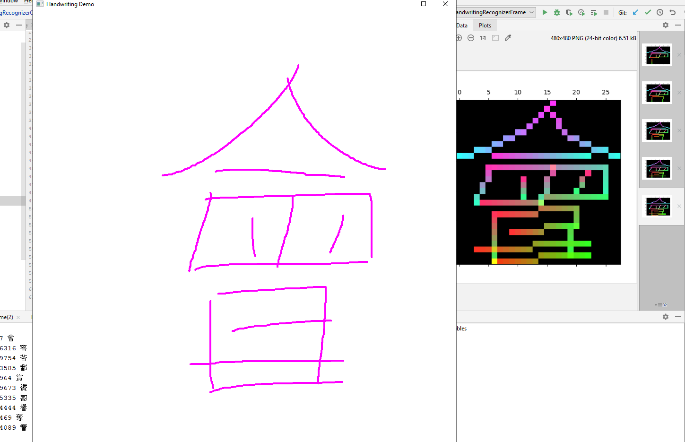
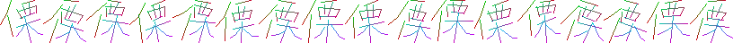

# cnn_chinese_hw

A **PyTorch** convolutional neural network for recognising **online
(stroke-based)** Chinese (Simplified/Traditional) and Japanese Kanji
handwriting, licensed under the LGPL 2.1.

An advantage over many other open-source engines is that strokes can be drawn
**out of order** (to an extent). It is intended to be used as an input method
and accepts the `(x, y)` coordinate points of strokes as input — this differs
from engines trained to recognise characters drawn on paper with a brush/pen.



> **Note on this version.** The recognizer was rewritten in PyTorch and the
> architecture modernised (compact SE-ResNet with global average pooling, ~2.9M
> parameters vs the previous >30M dense model). The TensorFlow/Keras/TFLite
> code and weights have been removed. See [`docs/ARCHITECTURE.md`](docs/ARCHITECTURE.md)
> for the design and the research it is based on. **You must train a model**
> (§ *Train the model* below) before recognition will work — no pre-trained
> checkpoint ships in the repository.

## Install

```console
pip install -r requirements.txt
pip install -e .
```

This pulls in `torch`, `numpy` and `svg.path`. A CUDA-capable GPU is strongly
recommended for training but is not required for inference. Optional extras:

```console
pip install -e ".[onnx]"   # ONNX export / framework-free inference
pip install -e ".[gui]"    # wxPython demo GUIs
```

## Recognize characters

```python
from cnn_chinese_hw.recognizer.recognizer import HandwritingRecognizer

rec = HandwritingRecognizer()        # loads + ensembles available hw_model.*.pt
print(rec.get_candidates_list(
    [[(208, 0), (199, 119), (94, 341)],
     [(0, 461), (781, 520), (915, 520), (999, 479)],
     [(189, 167), (213, 209), (238, 826), (268, 934), (203, 910)],
     [(303, 514), (94, 766)],
     [(462, 17), (497, 586), (522, 688), (646, 886), (796, 1000)],
     [(716, 628), (462, 916)],
     [(696, 101), (771, 155), (835, 251)]]
))
```

This returns a ranked list of `(score, ordinal)` pairs (use `chr(ordinal)` for
the character), e.g. for `我` (ordinal 25105):

```python
[(0.9989, 25105), (0.0004, 22941), (0.0002, 30330), ...]
```

Pass `tta=N` to average the prediction over `N` randomly-augmented renders for
a small accuracy gain at higher latency:
`rec.get_candidates_list(strokes, tta=8)` (default `0`, i.e. a single fast
render).

The same API is also exposed as a service via
`cnn_chinese_hw.client_server.HWServer.HWServer`, which returns
`{'cands_list': [...characters...], 'id': ...}` and is what the wider
application consumes.

## Train the model

Training renders the stroke corpora into multi-channel directMaps on the fly
and trains the network from scratch.

```console
# Quick end-to-end pipeline check on a tiny subset (a few seconds):
python -m cnn_chinese_hw.recognizer.train --smoke

# Train the two license-separated models (each writes its own checkpoint):
python -m cnn_chinese_hw.recognizer.train --license-group permissive   # -> hw_model.permissive.pt
python -m cnn_chinese_hw.recognizer.train --license-group ccbysa       # -> hw_model.ccbysa.pt

# Common overrides:
python -m cnn_chinese_hw.recognizer.train --license-group permissive --epochs 200 --batch-size 384
```

The recognizer loads and ensembles whichever `hw_model.<group>.pt` checkpoints
exist (falling back to a legacy single `hw_model.pt`). Train only `permissive`
if you want commercially-clean, share-alike-free weights.

The first run parses the stroke trajectories and caches them to
`data/stroke_cache.<group>.pkl` (subsequent runs reuse it). The best checkpoint
by **top-k** validation accuracy is saved to `data/hw_model.<group>.pt` and
contains the weights, the model/data config, the class list and a fitted
calibration temperature — everything the recognizer needs. Training uses
class-balanced
sampling, GRN blocks, an EMA of the weights (with warm-up), reports both top-1
and top-k each epoch, and finishes by temperature-scaling the candidate scores
on the validation set so the reported confidences are well calibrated.

Optional modern-recipe regularisers are implemented but off by default:
Mixup/CutMix (set `TrainConfig.mixup_alpha`≈`0.1`, `cutmix_alpha`≈`1.0`) and
Sharpness-Aware Minimization (`--sam`), which targets the small-data / many-class
regime by seeking flat minima.

See [`docs/ARCHITECTURE.md`](docs/ARCHITECTURE.md) §7 for the roadmap toward
compositional / zero-shot recognition (recognising characters unseen in
training) and richer input encodings.

### Export for framework-free inference (optional)

```console
pip install onnx onnxruntime
python -m cnn_chinese_hw.recognizer.export_onnx --quantize
```

This writes `data/hw_model.onnx` (+ an int8 graph with `--quantize`) and a
`hw_model.classes.json` index map, runnable under `onnxruntime` with no
TensorFlow/PyTorch dependency.

## How it works (in brief)

The character's online strokes are normalised, simplified to their key vertices
and rendered into a small `48×48×3` image. The three channels separately encode
the **start** of strokes, the **end** of strokes, and the **stroke order**, so
that direction and order remain recoverable from a single static image — this
is what lets the model tolerate out-of-order drawing. Light geometric
augmentation (rotation, scale, displacement, jitter, radial distortion) is
applied during training.

> 

The image is classified by a compact residual CNN with Squeeze-and-Excitation
channel attention, anti-aliased (shift-invariant) downsampling, and a
global-average-pooling head. It is trained with AdamW + cosine schedule, label
smoothing, class-balanced sampling and is selected on top-k validation accuracy
(the metric that matters for a candidate list). The full design and the papers
each choice draws on are documented in
[`docs/ARCHITECTURE.md`](docs/ARCHITECTURE.md).

Because the data was drawn by only a few people, recognition of some people's
handwriting may be weaker; a few hundred deliberately-varied characters drawn
by the author are mixed in to broaden coverage. The
[Make Me a Hanzi](https://github.com/skishore/makemeahanzi) stroke-median corpus
(~9.5k characters, Arphic Public License) is also mixed in as an extra training
source to widen character coverage — toggle it with `DataConfig.use_makemeahanzi`.

Because the corpora carry mutually copyleft-incompatible licenses (CC BY-SA,
LGPL, Arphic PL), they are **not co-mingled in one model**. Instead each
*license group* (`DataConfig.license_group`) trains its own checkpoint —
`permissive` (Tomoe + Make Me a Hanzi, validated on held-out KanjiVG) and
`ccbysa` (KanjiVG, validated on held-out Tomoe) — and the recognizer combines
whichever checkpoints are present at inference (summed calibrated
probabilities). This keeps the share-alike KanjiVG data out of the permissive
model's weights; see [`THIRD_PARTY_DATA.md`](THIRD_PARTY_DATA.md) and the License
section.

## Project layout

```
cnn_chinese_hw/
  recognizer/      PyTorch model, dataset, training, inference, ONNX export
    config.py        single source of truth for geometry + hyper-parameters
    model.py         DirectMapSENet (SE-ResNet + GAP)
    dataset.py       on-the-fly directMap dataset (replaces the old .npz)
    train.py         training entry point
    recognizer.py    inference (HandwritingRecognizer)
    export_onnx.py   ONNX export (replaces the old TFLite path)
  stroke_tools/    stroke normalisation, vertex extraction, rasterisation
  parse_data/      Tomoe + KanjiVG + Make Me a Hanzi corpus parsers
  client_server/   HWServer service wrapper
  gui/             wxPython demo canvases (drawing / registering samples)
  data/            source corpora (Tomoe XML, KanjiVG, Make Me a Hanzi, supplemental)
docs/              architecture notes + figures
```

## License

Because it uses [Tomoe](https://sourceforge.net/projects/tomoe/) data, this
project and the supplemental data are under the same license (LGPL 2.1).
[Make Me a Hanzi](https://github.com/skishore/makemeahanzi) `graphics.txt` is a
training source for the `permissive` model under the **Arphic Public License**
(commercial use permitted; not GPL). [KanjiVG](https://kanjivg.tagaini.net/)
(CC BY-SA 3.0) trains only the **separate** `ccbysa` model, so those weights are
CC BY-SA while the `permissive` model's weights stay free of share-alike. The
licenses never co-mingle in one weight file — they meet only as combined outputs
at inference. Ship whichever models your licensing allows. All third-party
corpora, their licenses and required attributions are documented in
[`THIRD_PARTY_DATA.md`](THIRD_PARTY_DATA.md).

```
Copyright (C) 2020-2026 Dave Morrissey

This library is free software; you can redistribute it and/or
modify it under the terms of the GNU Lesser General Public
License 2.1 as published by the Free Software Foundation.

This library is distributed in the hope that it will be useful,
but WITHOUT ANY WARRANTY; without even the implied warranty of
MERCHANTABILITY or FITNESS FOR A PARTICULAR PURPOSE.  See the GNU
Lesser General Public License for more details.

You should have received a copy of the GNU Lesser General Public
License along with this library; if not, write to the Free Software
Foundation, Inc., 51 Franklin Street, Fifth Floor, Boston, MA  02110-1301
USA
```
